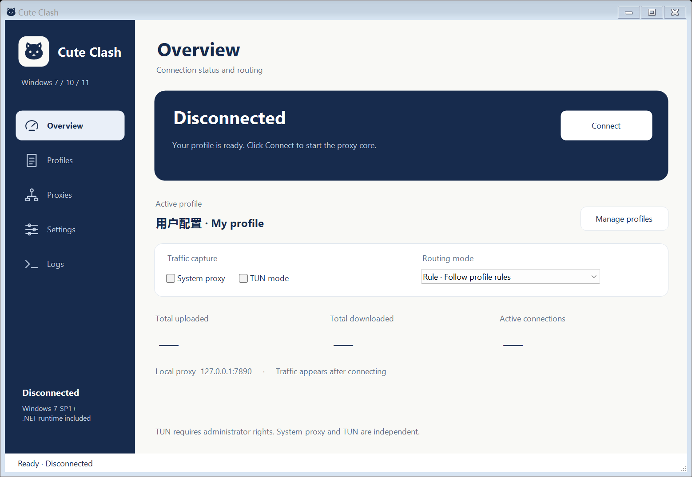

<p align="center"></p>

# Cute Clash

[简体中文](README.md) · **English**

A native Clash / Mihomo desktop client for **Windows 7 SP1, Windows 10 and Windows 11**, with Chinese and English interfaces. Version **0.3.1** includes its own .NET runtime and native support libraries: no separate .NET Framework, .NET Desktop Runtime or VC++ installation is needed. The approved navy kitten artwork and interface remain unchanged. No Electron, WebView or browser runtime is required.

**0.3.1 is a connection repair preview.** A Windows 7 SP1 x64 user reported that 0.3.0 showed Connected without working proxy traffic. This release addresses reproduced listener failures, missing dial-up proxy handling and download behavior, and checks the actual TUN adapter and routes. Tests run on Windows 11; Windows 7 machine/VM acceptance remains pending. These results do not establish that the reported machine is fixed. See the [changes](CHANGELOG.md) and [open-source references](docs/OPEN-SOURCE-REFERENCES.md).

## Download

Use the [0.3.1 repair preview Release](https://github.com/Watertube-bilibili/cute-clash/releases/tag/v0.3.1) for downloads with the runtime included:

| Windows architecture | Installer | Portable ZIP |
| --- | --- | --- |
| 64-bit | [x64 setup](https://github.com/Watertube-bilibili/cute-clash/releases/download/v0.3.1/cute-clash-0.3.1-windows-x64-setup.exe) | [x64 ZIP](https://github.com/Watertube-bilibili/cute-clash/releases/download/v0.3.1/cute-clash-0.3.1-windows-x64.zip) |
| 32-bit | [x86 setup](https://github.com/Watertube-bilibili/cute-clash/releases/download/v0.3.1/cute-clash-0.3.1-windows-x86-setup.exe) | [x86 ZIP](https://github.com/Watertube-bilibili/cute-clash/releases/download/v0.3.1/cute-clash-0.3.1-windows-x86.zip) |

Both include the same runtime. Setup adds shortcuts, an uninstaller and optional `clash://` handling. Extract the entire portable ZIP; copying only its EXE will not work. Releases include checksums, application source and complete Mihomo source materials.



Navy navigation, a light workspace and the kitten icon appear across Overview, Profiles, Proxies, Settings and Logs. This preview was rendered by the application on the development machine with a sample profile.

## Get started

1. On Windows 10/11, run the matching installer. Windows 7 needs **SP1**, **KB3063858** or a superseding loader update, plus **KB4490628** and **KB4474419** for signed driver support. Setup checks loader APIs and explains missing requirements. See [Compatibility](docs/COMPATIBILITY.md).
2. Open Cute Clash from the Start menu, or extract the complete portable ZIP and run `cute-clash.exe`. Setup installs for the current user without elevation; TUN requires elevation when enabled.
3. To switch from the default Chinese interface, open **设置 → 语言**, choose **English**, apply and restart the app when prompted. Switching language does not reconnect automatically.
4. Import a local YAML file or a **Clash / Mihomo YAML subscription URL** in Profiles. No proxy service or subscription is included. Raw Base64 node lists and individual `vless://` links are not converted.
5. Select a profile and connect. Enable System proxy for applications using Windows proxy settings, or configure HTTP / SOCKS5 `127.0.0.1:7890` directly in an app.
6. For **TUN**, use Settings to restart as administrator, enable TUN and connect. Wintun and the gVisor stack handle the virtual adapter, automatic routes and DNS interception. Initial driver loading can take time.
7. Choose groups and nodes in Proxies. Rule, global and direct modes are supported. Latency tests request `https://www.gstatic.com/generate_204` through the selected node.

Closing or minimizing the window hides it in the notification area. Use the tray's Exit command to stop completely. The app starts disconnected. Disconnecting and exiting attempt to restore previous WinINet proxy settings. A helper process and a Windows job object handle proxy recovery and core cleanup after an unexpected GUI exit. Recovery preserves changes made by another application or the user.

Provider one-click import buttons using `clash://install-config?url=…&name=…` open a prefilled confirmation dialog, including when the app is already running. Download starts only after Add; the app does not connect automatically. Select the protocol component during setup. An existing handler is left selected by default unless you explicitly choose to replace it. See [import formats](docs/QUICK-IMPORT.md).

## Features

- YAML profile import, subscription updates, validation, selection and deletion.
- `clash://` import links, private forwarding to the running instance and import confirmation.
- Proxy groups, node selection, latency tests and traffic counters.
- HTTP / SOCKS5 mixed listener, system proxy, rule / global / direct routing.
- Administrator TUN mode using Wintun, gVisor, automatic routes and DNS interception.
- Chinese / English UI, dialogs, tray menu and application diagnostics; original user names and core logs stay unchanged.
- Native tray, logs, configurable ports and administrator restart.
- Atomic configuration saves and rollback, random local API authentication and bounded YAML parsing.

The pinned engine is **Mihomo v1.19.31**, checked on 2026-09-22. It supports configurations for Shadowsocks / SS2022, VMess, VLESS / REALITY, Trojan, Hysteria2, TUIC v5, AnyTLS and WireGuard, among others. Exact interoperability depends on the core and server versions. [Protocol templates](examples/protocols-reference.yaml) pass the bundled core's syntax check but contain **no working servers or private credentials**. This is not a claim of support for every new server extension, XHTTP or future protocol.

[direct-test.yaml](examples/direct-test.yaml) forwards directly and is only a local functionality example. It does not provide a proxy service.

## Windows 7 compatibility

Official Mihomo Windows builds use a Go toolchain with Windows 7 compatibility patches. The x64 package uses the **amd64-v1** CPU baseline. The GUI bundles **.NET 6.0.36**, the final .NET series compatible with Windows 7; that series is out of Microsoft support. Its lifecycle is separate from the current Mihomo protocol core. UCRT and VC support files come from the official runtime package. VxKex NEXT is not bundled. See the [compatibility notes](docs/COMPATIBILITY.md) and [test matrix](docs/TESTING.md).

## Data and configuration

New installations use `%LOCALAPPDATA%\cute-clash`. If the former `win7-clash` data directory already contains settings and the new directory does not, the application reuses the existing directory in place. This preserves profiles without moving or overwriting files. Open the actual data folder from Settings.

Subscription URLs and credentials are local user data. Access is restricted to the current user, administrators and SYSTEM. Backups may also contain credentials. Log redaction hides URLs and common secret fields, but logs can still include domain names, IP addresses and node names.

Source profiles live in `profiles`; the managed `core/runtime.yaml` is removed when the core stops. The app owns inbound ports, API authentication, TUN, DNS listener addresses and loopback binding. It removes extra inbound listeners, external dashboards, script overrides and NTP clock-setting requests. Unknown node protocol fields are passed to Mihomo.

Provider caches are written under `providers/<profile-id>` with managed names. Absolute paths and directory traversal in imported provider paths are rejected. Local `type: file` provider contents must be placed in the managed path shown by the runtime configuration; arbitrary source-relative files are not copied automatically. HTTP/HTTPS providers download normally. GEO rules may require the core to fetch a database on first use.

System proxy changes affect the current user's WinINet LAN connection and enumerated dial-up / VPN connections. Each connection's PAC / auto-detect settings are saved separately and writes are read back. Failed changes attempt rollback; restoration preserves another application's changes. Machine-wide WinHTTP remains unchanged. Use TUN when broader application coverage is required.

## Build

On a 64-bit Windows development machine with **PowerShell 5.1 or later**:

```powershell
powershell.exe -NoProfile -ExecutionPolicy Bypass -File .\scripts\fetch-dependencies.ps1
powershell.exe -NoProfile -ExecutionPolicy Bypass -File .\scripts\build-windows.ps1 -RunTests -Package -Installer
```

The script downloads pinned .NET SDK and NSIS tools into `.tools`, without system installation. End users need no SDK or PowerShell. Outputs are in `dist`; dependencies are pinned in `dependencies.lock.json`, `runtime.lock.json` and `installer/toolchain.lock.json`. Tests use isolated directories, a fake proxy store, local HTTP fixtures and the real core. They do not activate host TUN or change host proxy settings. The older Framework build project remains available to developers; standard Releases use the bundled-runtime project.

The SVG source is [assets/cute-clash.svg](assets/cute-clash.svg); PNG and a multi-resolution ICO are included. The executable and tray load the embedded ICO, so no SVG engine is needed at runtime. `scripts/render-icon.cjs` regenerates the derived icon files when the artwork changes.

When upgrading the engine, check official Windows 7 support, choose the matching x64-v1 or x86 build, verify its digest, update the lockfile and repeat target-system acceptance tests. The GUI does not hard-code a fixed protocol list or silently replace the core with an unverified latest build.

## License

The application and its original kitten artwork are GPL-3.0. Preserve [LICENSE](LICENSE) and the [third-party notices](licenses/THIRD-PARTY-NOTICES.md). Wintun's official DLL has a separate prebuilt-binary license. Downloaded cores, local application data, test outputs and credentials are excluded from the source repository.
