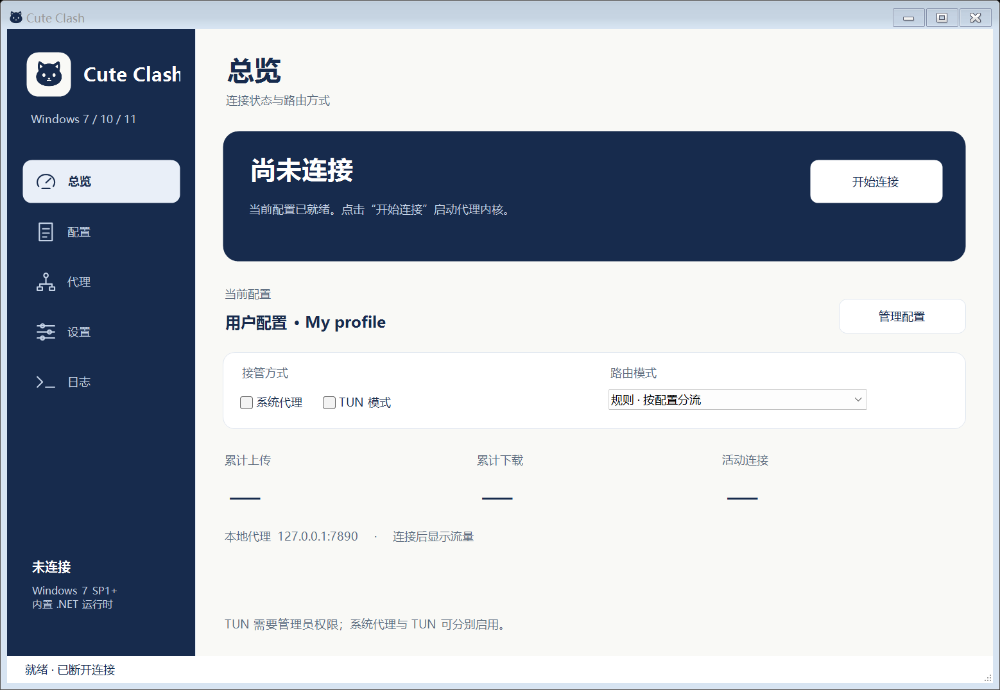

<p align="center"></p>

# Cute Clash

**简体中文** · [English](README.en.md)

**Cute Clash 是一款 Clash / Mihomo Windows 桌面客户端，支持 Windows 7 SP1、Windows 10 和 Windows 11。** 版本 **0.3.0** 提供简体中文 / English、系统代理、TUN 和机场订阅一键导入。普通 Windows 发行包已经内置 .NET 运行时，无需先安装 .NET Framework、.NET Desktop Runtime 或 VC++ 运行库。没有 WebView、Electron 或浏览器运行时依赖。

**兼容性与实测分开记录：** Windows 11 已进行程序与实际核心测试；Windows 7 SP1 是保留的最低系统目标，Windows 10 也属于目标系统，但两者尚未完成实机 / 虚拟机验收。真实远程节点与 TUN 路由仍待相应环境验证，不能用上游兼容声明代替实测。

## 下载

从 [GitHub Releases](https://github.com/Watertube-bilibili/cute-clash/releases/latest) 下载可直接使用的发行包：

| 系统位数 | 安装包 | 免安装便携包 |
| --- | --- | --- |
| 64 位 Windows | [x64 安装包](https://github.com/Watertube-bilibili/cute-clash/releases/download/v0.3.0/cute-clash-0.3.0-windows-x64-setup.exe) | [x64 ZIP](https://github.com/Watertube-bilibili/cute-clash/releases/download/v0.3.0/cute-clash-0.3.0-windows-x64.zip) |
| 32 位 Windows | [x86 安装包](https://github.com/Watertube-bilibili/cute-clash/releases/download/v0.3.0/cute-clash-0.3.0-windows-x86-setup.exe) | [x86 ZIP](https://github.com/Watertube-bilibili/cute-clash/releases/download/v0.3.0/cute-clash-0.3.0-windows-x86.zip) |

安装包和 ZIP 均自带相同运行环境。安装包额外提供快捷方式、卸载入口和 `clash://` 链接关联；ZIP 需完整解压，不能只取出其中的 EXE。Release 同时提供 SHA256 清单、应用源码和随附 Mihomo 的完整源码材料。



海军蓝导航、浅色工作区和小奶猫图标贯穿总览、配置、代理、设置与日志五个页面。上图是程序在开发机上的界面预览，使用示例配置。

## 开始使用

1. Windows 10 / 11 直接运行对应位数的安装包。Windows 7 请先确保是 **SP1**，具备 **KB3063858** 或替代它的系统加载器更新；签名驱动还需要服务堆栈 **KB4490628** 和 SHA-2 更新 **KB4474419**。安装器会检查加载接口并提示缺失项，不会偷偷修改系统补丁。详细来源见 [兼容性说明](docs/COMPATIBILITY.md)。
2. 安装后从开始菜单打开 Cute Clash；也可解压便携 ZIP，保留整个目录结构并运行 `cute-clash.exe`。安装到当前用户目录不需要管理员权限，TUN 运行时才需要提权。
3. 在“配置”页导入本地 `.yaml/.yml`，或添加 **Clash / Mihomo 格式**的订阅 URL。软件不提供代理服务器或付费订阅，也不转换原始 Base64 节点列表及 `vless://` 单节点链接。
4. 选定配置，在总览页连接。普通浏览器代理可开启“系统代理”；也可在单个应用内手动设置 HTTP / SOCKS5 `127.0.0.1:7890`。
5. 若要接管不遵循系统代理的应用，在设置页“以管理员身份重启”，随后开启 **TUN 模式**并连接。TUN 使用随附 Wintun 和 gVisor，管理路由及 DNS 劫持。首次加载驱动可能需要等待。
6. 在“代理”页选择策略组和节点。规则、全局、直连模式均可切换；节点测速会访问 `https://www.gstatic.com/generate_204`。

在 **设置 → 语言 → English** 选择英文并应用，按提示重新打开应用后生效。界面、托盘、对话框和程序自身错误提示均支持英文；节点名称、用户配置名称和内核原始日志保留原内容。语言切换不会自动重新连接。

机场网页的“一键导入 Clash”按钮通常使用 `clash://install-config?url=…&name=…`。安装时选择“处理 clash:// 订阅链接”后，点击它会唤起 Cute Clash，打开已填写的订阅确认窗口；点击“添加”才会下载配置，不会自动连接。应用已经在托盘中运行时也可接收。已有其他代理软件处理此协议时，安装器默认保留原应用；可在安装组件页主动选择更换。支持格式及编码规则见 [快速导入](docs/QUICK-IMPORT.md)。

点击关闭或最小化会进入系统托盘，继续保持当前连接。完全关闭请使用托盘菜单“退出”。正常退出、断开和内核退出会尝试恢复原来的系统代理；界面异常退出时另一个恢复进程负责恢复，并由进程作业对象关闭自己的内核。下一次启动仍会检查残留恢复记录。系统代理恢复不会覆盖用户或其他软件在运行期间改过的设置。启动应用不会自动连接。

## 已实现功能

- 本地 YAML、订阅 URL 导入；更新订阅、选择、删除及核心校验。
- `clash://` 订阅链接唤起、单实例转发与导入确认。
- Clash / Mihomo 规则和代理组、节点切换、延迟测试、流量统计。
- HTTP / SOCKS5 混合端口、本机系统代理、规则 / 全局 / 直连模式。
- 管理员 TUN：Wintun、gVisor、自动路由、网卡检测、DNS 劫持、启动失败提示。
- 简体中文 / English 原生界面、托盘、运行日志、端口设置及管理员重启。
- 配置原子保存与备份、失败更新回退；随机 API 密钥、本机监听、配置资源上限。

随包核心是 **Mihomo v1.19.31**，核对日为 2026-09-22。支持的协议包括 Shadowsocks / SS2022、VMess、VLESS / REALITY、Trojan、Hysteria2、TUIC v5、AnyTLS、WireGuard 等，具体字段和互操作范围取决于核心版本及服务器实现。`examples/protocols-reference.yaml` 提供八种协议的占位模板，已经通过两种架构的核心语法校验，**不含可用服务器或真实凭证**。这不表示所有服务器版本、XHTTP 或未来扩展都已经支持。

`examples/direct-test.yaml` 仅用于检查应用与本地转发，所有请求直连；它不能提供代理服务。

## Windows 7 与 VxKex NEXT

Mihomo 官方 Windows 构建使用带 Win7 兼容补丁的 Go 工具链；x64 包选择适合旧 CPU 的 **amd64-v1**。Windows Forms 使用随应用携带的 **.NET 6.0.36**，这是微软最后一个兼容 Windows 7 的 .NET 系列，已经停止官方维护；运行时与当前协议核心分别管理，不代表冻结 Mihomo 的协议能力。应用本地还附带官方运行时包中的 UCRT 与 VC 支持文件。当前包 **没有捆绑或安装 VxKex NEXT**。

前置条件、官方依据和待验收项目见 `docs/COMPATIBILITY.md`、`docs/TESTING.md`。

## 数据与配置处理

新安装的数据位于 `%LOCALAPPDATA%\cute-clash`。如果之前使用过 win7-clash，且新目录还没有设置文件，程序会直接沿用 `%LOCALAPPDATA%\win7-clash` 中已有的数据，不移动或覆盖旧配置。可从设置页打开实际数据目录。订阅地址和节点凭证保存在当前用户的数据目录中，访问权限限制为该用户、管理员及 SYSTEM。备份也可能含凭证；分享文件前请自行脱敏。日志对 URL、常见密钥字段作遮蔽，但日志仍可能含访问域名、IP 与节点名称。

原配置保存在 `profiles`；运行配置位于 `core/runtime.yaml`，退出时移除。软件统一管理端口、控制器密钥、TUN、DNS 监听地址和本机监听策略，不执行订阅里的额外入站、脚本、外部面板或 NTP 修改系统时间设置。未知的节点协议字段会保留交给 Mihomo。

远程 rule/proxy-provider 缓存写入 `providers/<配置ID>` 内生成的路径，绝对路径或目录跳转会被拒绝。若使用 `type: file` 的 Provider，需自行将对应文件放入受管路径，可在生成的运行配置中查看位置。常见 HTTP/HTTPS Provider 可直接下载；源配置的相对文件不会自动被复制。首次使用 GEO 数据规则时，核心可能需要联网下载数据。

系统代理修改的是当前用户的 WinINet 默认连接设置，并保留 PAC / 自动检测状态以便恢复；它不修改系统级 WinHTTP 或每个 VPN / 拨号连接的独立代理。需要覆盖更多应用时使用 TUN。

## 从源码构建

普通 Windows 发行包的构建需要 Windows x64 开发机和 PowerShell 5.1 或以上。脚本会在项目 `.tools` 中下载并校验固定版本的 .NET SDK 与 NSIS，不向系统安装开发工具。用户运行发行包不需要 PowerShell、SDK 或预装 .NET。

```powershell
powershell.exe -NoProfile -ExecutionPolicy Bypass -File .\scripts\fetch-dependencies.ps1
powershell.exe -NoProfile -ExecutionPolicy Bypass -File .\scripts\build-windows.ps1 -RunTests -Package -Installer
```

输出在 `dist`。依赖固定于 `dependencies.lock.json`、`runtime.lock.json` 与 `installer/toolchain.lock.json`；下载校验后再使用。测试使用隔离目录、假系统代理存储、本机 HTTP 服务和真实 Mihomo 内核；不修改开发机代理或打开 TUN。源码同时保留 `.NET Framework 4.8` 构建工程，供已有开发环境使用；普通 Release 使用自带运行时的工程。

应用图标的可编辑源文件是 `assets/cute-clash.svg`，随仓库附带 PNG 预览和多尺寸 ICO。程序图标和托盘使用内嵌 ICO，无需在 Windows 7 上安装 SVG 渲染库。图标再生成脚本位于 `scripts/render-icon.cjs`，仅修改图标时需要额外构建工具。

核心升级方法：先检查官方稳定版是否仍声明支持 Windows 7，选择 x64-v1 或 x86 对应文件，校验官方摘要，更新锁文件后重建，并重新运行 Win7 验收。GUI 不锁死代理协议清单，因此新核心可提供新增协议；本版本没有未经验证的自动覆盖升级。

源码采用 GPL-3.0；保留 `LICENSE` 和 `licenses` 中的第三方许可。Wintun 二进制使用官方单独的预编译二进制许可。对应源码与对外发布注意事项见 `licenses/THIRD-PARTY-NOTICES.md`。
